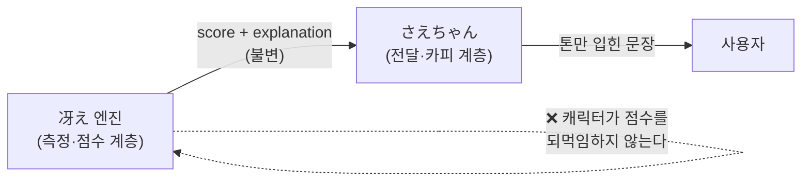

# さえちゃん 페르소나 · 대사 시스템 (Character Voice)

> 冴え 엔진이 만든 **차가운 숫자**를 사용자에게 **따뜻하게 전달**하는 캐릭터 계층 설계.
> 헌법 **제4조(차가운 데이터, 따뜻한 전달)**의 실천 문서다. 핵심 규칙 한 줄:
> **さえちゃん은 톤만 데운다. 숫자는 절대 바꾸지 않는다.**
> 카피는 사용자에게 보이는 문자열이므로 **하드코딩 금지, String Catalog로 3언어**(제5조).
> 이 문서는 카피의 *실제 번역*이 아니라 **목소리의 설계**를 정의한다.

- **최종 수정:** 2026-07-20
- **상태:** UX/카피 설계 문서 (구현은 2주차 이후, 점수가 나온 뒤)
- **입력:** `score-algorithm.md`의 `DailyScore.score` + `explanation`
- **캐릭터:** さえちゃん / Saechaan / 사에짱 (`CONCEPT.md` §3)

---

## 0. 이 문서가 헌법을 지키는 법

| 조항 | 여기서 어떻게 |
|------|--------------|
| **제2조 (정직성)** | 나쁜 점수를 좋게 포장하지 않는다. 사실(explanation)을 왜곡·삭제하지 않는다. **의학 진단을 흉내 내지 않는다.** |
| **제4조 (따뜻한 전달)** | 따뜻함은 **표현의 영역**, 데이터의 영역이 아니다. 진지한 冴え 엔진 / 친근한 さえちゃん은 **분리된 계층**. 대사는 **행동 가능한 안내**로 끝맺고, 겁주지 않는다. |
| **제5조 (국제화 1급)** | 3언어 동등. 문자열 하드코딩 금지. 「冴え」 말장난은 언어별 태그라인으로 의미 보완. |
| **제7조 (단순함)** | 대사 카탈로그는 MVP 범위. 과한 대화엔진·분기 트리를 미리 만들지 않는다. |

---

## 1. 계층 분리 — 가장 중요한 규칙



- **단방향.** 엔진 → 캐릭터. 캐릭터는 점수·사실을 **읽기만** 한다. 점수를 반올림·미화·재해석하지 않는다.
- 같은 점수는 **항상 같은 사실**을 전달한다. 톤(문장 변주)만 다를 수 있다.
- 캐릭터를 지워도 숫자는 그대로 성립해야 한다(제4조 2항 "분리된 계층").

---

## 2. 페르소나 — さえちゃん은 누구인가

**한 문장:** 매일 곁에서 내 각성 상태를 **솔직하게, 그러나 다정하게** 알려주는 작은 동행자.

| | |
|--|--|
| **역할** | 측정 결과의 **통역사**. 숫자를 사람 말로 옮긴다. |
| **성격** | 차분·다정·담백. 호들갑스럽지 않다. 응원하되 아부하지 않는다. |
| **말투** | 친근한 반존대(한국어 해요체 / 일본어 です・ます의 부드러운 결 / 영어 warm-casual). 이름: 흔한 여자 이름 さえ + ちゃん(애칭). |
| **관점** | 사용자 편. 판단·훈계가 아니라 **관찰 + 제안**. |

**さえちゃん이 *아닌* 것 (경계선)**
- ❌ 의사·진단자가 아니다 — "수면부족입니다", "병원 가세요" 안 함(제2조 4항).
- ❌ 응원 봇이 아니다 — 나쁜 날을 "완전 좋아요!"로 덮지 않음(제2조 1항, 제4조 1항).
- ❌ 죄책감 유발자가 아니다 — "또 못 잤네요?" 같은 질책·수치심 금지(제4조 3항).
- ❌ 점수의 주인이 아니다 — 숫자를 만들거나 바꾸지 않음(§1).

---

## 3. 대사의 해부학 — 3단 구조

모든 대사는 같은 뼈대를 따른다. 이 구조가 "정직 + 따뜻 + 행동가능"을 동시에 보장한다.

```
[① 사실]        점수·핵심 지표를 왜곡 없이.        ← explanation에서 온다 (제2조)
[② 따뜻한 프레이밍]  사실을 다정한 톤으로 감싼다.        ← 여기만 캐릭터의 영역 (제4조)
[③ 행동 유도]     안전하고 작은 다음 행동 제안.       ← 겁주지 않고 행동가능 (제4조 3항)
```

**예 (冴え度 60):**
> ① 오늘 冴え度는 60점, lapse가 3번 있었어요. — ② 살짝 무딘 편이에요. — ③ 잠깐 눈 붙이거나 물 한 잔 어때요?

- ①은 `explanation`을 옮긴 것 — **빼거나 바꾸지 않는다.**
- ②는 톤. ③은 **의학이 아닌 생활 제안**(§5 안전 목록).

---

## 4. 점수대별 톤 매핑

冴え度 밴드별 톤·행동 제안. **낮은 점수도 사실대로, 다만 부드럽게.** (예시는 한국어 작업 기준 — 3언어는 §6·String Catalog)

| 밴드 | 상태 라벨 | 톤 | 예시 대사(한국어) | ③ 행동 유도 방향 |
|------|-----------|-----|------------------|-----------------|
| **80–100** | 冴えてる (예리) | 밝게, 담백한 축하 | "오늘 아주 맑아요 — 冴え度 88. 지금이 집중 골든타임이에요." | 중요한 일 지금 하기 |
| **60–79** | 안정 | 잔잔한 긍정 | "冴え度 72, 꽤 안정적이에요. 무리 없이 갈 만해요." | 평소 페이스 유지 |
| **40–59** | 살짝 무딤 | 다정한 주의 환기 | "冴え度 52 — 조금 무딘 편이에요. lapse가 늘었어요." | 짧은 휴식·수분·가벼운 스트레칭 |
| **20–39** | 피곤 | 부드럽게, 재촉 없이 | "오늘은 좀 피곤해 보여요, 冴え度 33." | 무리한 집중 미루기·쉬기 제안 |
| **0–19** | 많이 지침 | 가장 조심스럽게, 안심 | "冴え度 12 — 많이 지친 날이에요. 스스로를 몰아붙이지 마요." | 휴식 우선, 자책 금지 문구 |

**밴드 경계는 톤만 가른다 — 숫자는 항상 그대로 노출.** 경계값(80/60/40/20)은 [열린 결정](#열린-결정).

---

## 5. 행동 유도(③) — 안전 목록 (제2조 4항 · 제4조 3항)

**허용:** 짧은 휴식, 눈 감기, 수분, 가벼운 스트레칭/산책, 심호흡, 집중 작업의 타이밍 조정, "잘 쉬었으니 좋네요" 류 관찰.
**금지:** 의학적 지시("~를 복용"), 진단("수면장애"), 수면시간 처방("8시간 자야"), 공포 유발("이대로면 위험"), 죄책감("어제 왜 안 잤어요").

> 원칙: **정보는 주되 처방은 하지 않는다.** 冴え는 계측 도구지 의료기기가 아니다(제2조).

---

## 6. 국제화 — 3언어 동등 (제5조)

### 6-1. 이름 · 태그라인 (`CONCEPT.md` §4와 정합)

| | 앱/캐릭터 이름 | 태그라인(의미 보완) | 말투 결 |
|--|----------------|--------------------|---------|
| 🇯🇵 일본어 | 冴え / さえちゃん | 「冴え」말장난 그대로 성립 | です・ます체의 부드러운 어미(~ですよ, ~ましょう) |
| 🇬🇧 영어 | Sae / Saechaan | "Know your sharpness" | warm-casual, 명령형 대신 제안형("how about…") |
| 🇰🇷 한국어 | 사에 / 사에짱 | "당신의 각성을 재다" | 해요체, 친근한 반존대 |

- 「冴え=예리함」 말장난은 **일본어에서만** 산다 → 영/한은 태그라인으로 의미 보완(제5조 3항). 세 언어 중 하나만 완성된 화면은 **미완성**이다(제5조 2항).

### 6-2. 같은 대사, 세 언어 (冴え度 60 데모)

| | 대사 |
|--|------|
| 🇯🇵 | 今日の冴え度は60点、ラプスが3回ありました。ちょっと鈍いみたい。少し目を閉じて、お水でもどうですか？ |
| 🇬🇧 | Your Sae score is 60 today — 3 lapses. A little dull. How about closing your eyes for a bit, or some water? |
| 🇰🇷 | 오늘 冴え度는 60점, lapse가 3번 있었어요. 살짝 무딘 편이에요. 잠깐 눈 붙이거나 물 한 잔 어때요? |

- 세 언어 모두 **①사실(60점·lapse 3회)을 동일하게** 담는다. 톤 어미만 언어답게.
- 숫자·지표는 로케일 포맷을 따르되(제5조), **값 자체는 왜곡 없이**.

### 6-3. 구현 원칙
- 대사는 **String Catalog(`.xcstrings`) 키**로 관리. 코드·이 문서에 문자열을 박지 않는다.
- 변수(점수·lapse수)는 **보간 플레이스홀더**로. 언어별 어순을 String Catalog가 흡수.
- 이 문서는 **키의 의미·톤 규칙**을 정의하고, 실제 번역은 카탈로그 작업(4주차 다국어)에서 채운다.

---

## 7. 특수 케이스

| 상황 | さえちゃん의 처신 |
|------|------------------|
| **무효 세션**(`isValid=false`, 점수 없음) | 가짜 점수 금지(제2조). "이번엔 측정이 조금 흔들렸어요. 한 번만 더 해볼까요?" — 재시도 유도, 자책 없음. |
| **신호 결측**(HRV·손떨림 없음) | 숨기지 않고 담백히: "오늘은 각성만 쟀어요." 결측을 결점처럼 말하지 않음. |
| **첫 사용/온보딩** | 자기소개 + 측정 의미 안내. 아직 추이가 없으니 비교·판단 자제. |
| **연속 저점** | 추이는 사실로만 언급, 훈계 금지: "며칠 무딘 편이에요." + 안심·휴식 제안. 공포·죄책감 금지(제4조 3항). |

---

## 8. 대사 카탈로그 — 구조 (제7조: 과설계 금지)

- 밴드 × 상황(정상/무효/결측/온보딩)별로 **여러 변주 문장**을 두고 **회전**시켜 반복 피로를 줄인다. 단, **①사실 부분은 데이터 바인딩**이라 항상 정확.
- 분기·상태를 가진 **대화 엔진을 만들지 않는다.** 지금은 "점수+상황 → 문장 선택"의 단순 매핑으로 충분(MVP).
- 톤/문장 품질은 카피이므로 코드가 아니라 **String Catalog + 이 설계 문서**가 진실의 원천.

---

## Deferred (지금 만들지 않는다 — 제7조)

- **적응형 개인화 대사**(사용자 이름·습관 학습) — 추이·baseline이 쌓인 뒤(`data-model.md` `UserProfile` Deferred와 연동).
- **음성/애니메이션 캐릭터** — 카피(텍스트) 계층부터. 목소리·모션은 스트레치.
- **시간대별 인사**(아침/밤 다른 톤) — 필요해지면.

---

## 열린 결정

- **밴드 경계값**(80/60/40/20) — 점수 분포 실데이터로 튜닝(`score-algorithm.md` 열린 결정과 공유).
- **말투 세부**(반말 옵션 제공 여부, 존대 수위) — 사용자 선호/문화 검토 후.
- **변주 문장 수**(밴드당 몇 개) — 반복 피로 vs 번역 비용 균형, 4주차 카탈로그 때.
- **캐릭터 비주얼 방향** — 이 문서는 목소리만. 비주얼은 디자인 단계(3주차)에서.

---

## 참고

- `CONSTITUTION.md` 제2·4·5·7조. `CONCEPT.md` §3(네이밍·계층 분리)·§4(다국어).
- `score-algorithm.md`(점수·explanation의 출처), `tech-stack.md` §6·7(String Catalog·전달 계층).
