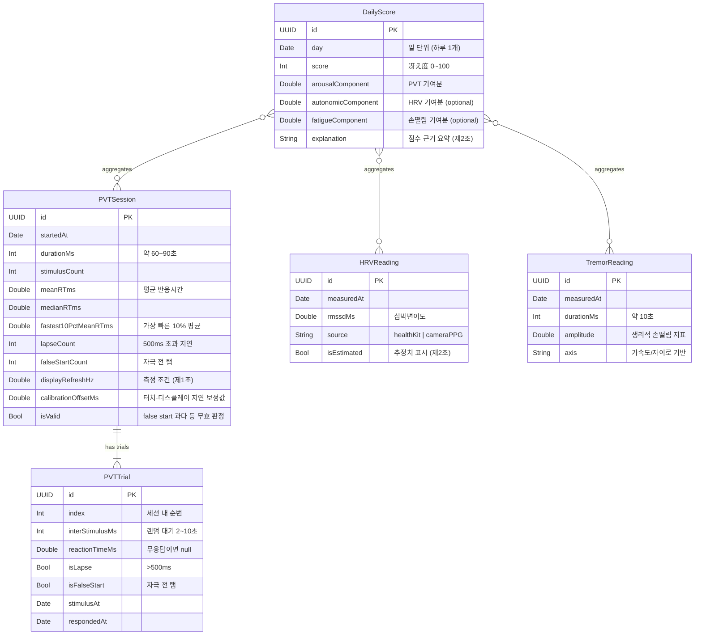

# 데이터 모델 (Data Model / ERD)

> 冴え(Sae)의 온디바이스 데이터 모델. **SwiftData** 스키마의 설계 근거다.
> 범위는 MVP 4주 계획(`CONCEPT.md` §7). 그 너머는 **Deferred**로 명시해 미리 만들지 않는다(헌법 제7조).
> 모든 데이터는 **온디바이스**에 남고 서버로 보내지 않는다(제3조).

- **최종 수정:** 2026-07-19
- **저장소:** SwiftData (로컬)

---

## 설계 원칙 (이 모델이 헌법을 지키는 법)

- **제1조(정확도):** 반응시간은 **탭 단위 원자료(`PVTTrial`)로 저장**한다. 세션 요약값만 남기면 나중에 검증·재분석이 불가능하다. 디스플레이 주사율·보정 오프셋도 세션에 함께 기록해 측정 조건을 재현 가능하게 한다.
- **제2조(정직성):** 冴え度 점수는 **구성요소(각성/자율신경/피로)를 쪼개 저장**한다. "왜 62점인가"에 답할 수 있어야 한다. 추정치(카메라 PPG 등)는 `isEstimated` 플래그로 표시한다.
- **제3조(프라이버시):** 계정·서버 개념 없음. 단일 사용자 온디바이스. 개인 식별정보를 모델에 두지 않는다.

---

## ERD

---

## 엔티티 설명

### `PVTSession` — 한 번의 PVT 측정 (제품의 심장)
90초 측정 1회. 세션 요약 지표(평균 RT, lapse, fastest 10%, false start)를 담되, **원자료는 `PVTTrial`에** 둔다. `displayRefreshHz`·`calibrationOffsetMs`는 제1조의 "측정하고 보정한다"를 데이터로 증명하는 필드다. false start가 과하면 `isValid=false`로 세션을 무효 처리.

### `PVTTrial` — 한 번의 자극-반응
한 세션은 여러 trial을 가진다(`||--|{`). 각 trial은 랜덤 대기(`interStimulusMs`, 2~10초) 후 자극→탭까지의 반응시간을 밀리초로 기록. 무응답(타임아웃)이면 `reactionTimeMs`는 null, `isLapse=true`. **이 원자료가 있어야 정확도를 사후 검증**할 수 있다(제1조 3항, 제2조 1항).

### `HRVReading` — 자율신경/회복 (2~3주차)
HealthKit(애플워치) 또는 스트레치의 카메라 PPG에서 온 HRV(RMSSD). `source`로 출처, `isEstimated`로 추정 여부를 명시한다(제2조 3항).

### `TremorReading` — 신체 피로 (3주차)
CoreMotion(가속도/자이로) 약 10초 측정에서 뽑은 생리적 손떨림 지표.

### `DailyScore` — 冴え度 (2주차~)
하루 1개. 세 신호를 융합한 0~100 점수. **구성요소를 분리 저장**해 설명 가능성을 보장하고(`explanation`), さえちゃん 대사는 이 값을 왜곡 없이 전달한다(제4조). HRV·손떨림이 없는 날은 각성(PVT) 성분만으로도 산출 가능하도록 두 성분은 optional.

---

## 관계 요약

- `PVTSession 1 : N PVTTrial` — 소유 관계(cascade delete). 세션을 지우면 trial도 지운다.
- `DailyScore N : M {PVTSession, HRVReading, TremorReading}` — 하루의 점수는 그날의 측정들을 참조해 계산. (구현 시 날짜 기준 조회로 단순화할지, 명시적 관계로 둘지는 2주차 스키마 작업에서 확정.)

---

## Deferred (지금 만들지 않는다 — 제7조)

- **`UserProfile` / 개인 baseline** — 冴え度를 "자신의 평소 대비"로 정규화하려면 개인 기준선이 필요하지만, MVP는 절대 지표부터. 개인화 정규화는 필요해지는 시점(3주차 이후)에 도입 검토.
- **다중 사용자 / 계정** — 온디바이스 단일 사용자 전제(제3조). 만들지 않는다.
- **원격 동기화 / 백업** — 서버 전송은 제3조를 먼저 고쳐야 생긴다.

---

## 열린 결정 (스키마 확정 전 정할 것)

- `DailyScore`의 집계를 **날짜 쿼리**로 할지 **명시적 관계**로 할지 (2주차).
- 冴え度 산출 **가중치·공식** — 별도로 `docs/`에 알고리즘 문서로 남긴다(제2조 2항, 설명 가능성).
- SwiftData 마이그레이션 전략 — 스키마 변경이 잦을 초기엔 가벼운 버전만.
