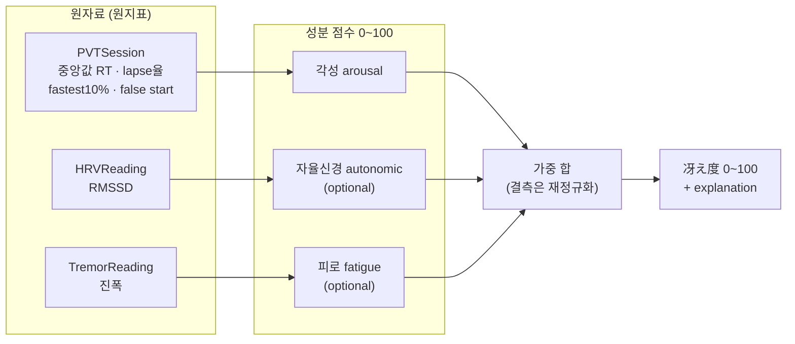

# 冴え度 점수 알고리즘 (Sae-do Score)

> 세 신호(각성·자율신경·피로)를 하루 **0~100 점수**로 합치는 공식·가중치·설명 로직.
> 이 문서의 존재 이유는 헌법 **제2조(과학적 정직성·설명 가능성)** 다. "왜 62점인가"에
> 답하지 못하는 블랙박스는 넣지 않는다. 여기의 모든 매핑은 **화이트박스**로 적는다.
> `data-model.md`·`tech-stack.md`·`CONCEPT.md`가 "별도 알고리즘 문서로 남긴다"고 미뤄둔 그 문서다.

- **최종 수정:** 2026-07-20
- **버전:** v0 (기본값·앵커는 **튜닝 대상**. → [열린 결정](#열린-결정))
- **상태:** 설계 문서 (코드 이전). 구현은 2주차(`CONCEPT.md` §7)

---

## 이 알고리즘이 헌법을 지키는 법

| 조항 | 이 문서에서 어떻게 |
|------|-------------------|
| **제1조 (정확도)** | 각성 성분은 `PVTTrial` 원자료에서 나온 세션 지표만 쓴다. 추정·보간 없음. |
| **제2조 (정직성)** | 모든 원지표→점수 매핑을 명시. 성분을 쪼개 저장(`DailyScore`). 추정치는 `isEstimated`로 표시. 임상/의학 척도가 **아님**을 밝힌다. |
| **제3조 (프라이버시)** | 전 계산은 온디바이스. 서버·외부 전송 없음. |
| **제4조 (차가운 데이터, 따뜻한 전달)** | 이 문서는 **숫자만** 만든다. さえちゃん은 이 값을 **왜곡 없이** 말로 옮길 뿐, 점수를 바꾸지 않는다. |
| **제7조 (단순함)** | MVP는 **절대 지표** 매핑. 개인 baseline 정규화는 [Deferred](#deferred-지금-만들지-않는다). |

---

## 한눈에 — 파이프라인



**설계 원칙 세 줄**
1. **각성(PVT)이 주(主)다.** 자율신경·피로는 있으면 보태는 보조 신호. 각성만으로도 점수가 나온다(`data-model.md`).
2. **각 원지표를 먼저 0~100 하위지표로** 변환(구간 선형 매핑) → 성분 점수 → 가중 합.
3. **결측 신호는 벌점이 아니라 가중치 재정규화.** HRV·손떨림이 없는 날을 "나쁜 날"로 만들지 않는다.

---

## 1. 각성 성분 (Arousal) — PVT 기반 · 필수

PVT의 표준 지표를 각각 0~100 하위지표로 만든 뒤 가중 합한다. **가장 수면부족에 민감한
lapse율에 가장 큰 가중치**를 준다(PVT 문헌의 정설: lapse가 수면부채에 가장 먼저·크게 반응).

### 1-1. 하위지표 매핑 (구간 선형, clamp 0~100)

| 하위지표 | 원지표 | 100점 앵커 (각성 최고) | 0점 앵커 (각성 붕괴) | 근거 |
|----------|--------|----------------------|---------------------|------|
| **lapse율** `L` | lapse수 / 유효 trial수 | 0% | ≥ 30% | lapse(>500ms)는 수면부족의 최고 민감 지표 |
| **중앙값 RT** `M` | `medianRTms` | ≤ 250 ms | ≥ 500 ms | 건강한 각성 성인 ~250–300ms, 500ms는 lapse 문턱 |
| **최속 10%** `B` | `fastest10PctMeanRTms` | ≤ 220 ms | ≥ 400 ms | 동기·최적 수행 능력의 상한을 반영 |

> 중앙값(median)을 평균(mean) 대신 쓴다 — RT 분포는 우측 꼬리가 길어(가끔 튀는 지연) **중앙값이 강건**하다. 평균·lapse가 꼬리를 따로 담당한다.

각 하위지표는 앵커 사이 **선형 보간** 후 [0,100]로 clamp. 예: `M(291ms) = 100 × (500−291)/(500−250) = 83.6`.

### 1-2. 각성 성분 합성

```
arousalRaw = 0.50·L + 0.35·M + 0.15·B        # 가중치는 v0, 튜닝 대상
arousal    = arousalRaw × falseStartFactor
```

- **가중치 근거:** lapse율이 수면부채에 가장 민감하므로 0.50. 중앙값 RT가 전반 각성 0.35.
  최속 10%는 능력 상한이라 보조 0.15. (합=1.0)
- **falseStartFactor (타당도 벌점):** 자극 전 탭(false start)은 충동·부주의·꼼수 신호.
  `falseStartCount` 기준 **곱셈 벌점**으로 유효 세션 안에서 감점한다.

  | false start 수 | factor |
  |----------------|--------|
  | 0 | 1.00 |
  | 1 | 0.97 |
  | 2 | 0.92 |
  | 3+ | → **세션 무효**(아래) |

### 1-3. 세션 타당도 게이트 (제2조 — 가짜 숫자 금지)

다음이면 `PVTSession.isValid = false` → **그날 `DailyScore`를 만들지 않거나** "측정 불충분"으로 표시. 억지 점수보다 "오늘은 못 쟀어요"가 정직하다.

- false start ≥ 3, 또는 유효 trial < 최소치(예: 5), 또는 무응답(타임아웃) 과다.
- 임계값 자체는 [열린 결정](#열린-결정).

---

## 2. 자율신경 성분 (Autonomic) — HRV 기반 · optional

애플워치/카메라 PPG의 **RMSSD**(부교감·회복 지표, 높을수록 회복 양호)를 0~100으로.

| 100점 앵커 | 0점 앵커 |
|-----------|---------|
| RMSSD ≥ 60 ms | RMSSD ≤ 20 ms |

> ⚠️ **정직성 경고(제2조 3항):** HRV 절대값은 **개인차가 매우 크다**(나이·체질·측정조건).
> 이 절대 매핑은 MVP용 **거친 근사**이며, 진짜 의미는 개인 baseline 대비에서 나온다
> → [Deferred](#deferred-지금-만들지-않는다)로 개인화 예정. 카메라 PPG 출처는 `isEstimated=true`로
> 표시하고 성분 신뢰도를 낮춰 다룬다.

---

## 3. 피로 성분 (Fatigue) — 손떨림 기반 · optional

CoreMotion 약 10초 측정의 **생리적 손떨림 진폭**(`TremorReading.amplitude`). 떨림이 클수록
신체 피로↑ → 점수↓ (**역매핑**).

| 100점 앵커 (안정) | 0점 앵커 (피로) |
|------------------|----------------|
| amplitude ≤ 하한 | amplitude ≥ 상한 |

> 구체 앵커(진폭 단위·범위)는 CoreMotion 실측 캘리브레이션이 필요 → 3주차 실측 후 확정([열린 결정](#열린-결정)).

---

## 4. 최종 冴え度 — 가중 합 + 결측 재정규화

기본 가중치(**모든 신호가 있을 때**):

| 성분 | 기본 가중치 `w` |
|------|----------------|
| 각성 arousal | **0.60** |
| 자율신경 autonomic | 0.25 |
| 피로 fatigue | 0.15 |

**결측 처리 — 재정규화:** 그날 존재하는 성분들의 가중치만 남겨 **합=1로 다시 나눈다.**

```
사용가능 성분 집합 = { 값이 있는 성분들 }   # 각성은 항상 포함(필수)
정규화가중치 wᵢ' = wᵢ / Σ(사용가능 성분의 w)
冴え度 = round( Σ  wᵢ'·성분ᵢ )               # 0~100 정수
```

- 각성만 있는 날: `冴え度 = round(arousal)` (가중치 0.60→1.00 재정규화).
- 각성+피로만: 각성 0.60/(0.60+0.15)=0.80, 피로 0.20.
- **각성이 없으면 점수를 만들지 않는다** (§1-3 게이트).

---

## 5. 설명 문자열 (`DailyScore.explanation`) — 왜 이 점수인가

블랙박스 금지(제2조 2항). 저장 시 **성분값과 주도 요인**을 함께 남긴다. さえちゃん 대사는
이 사실을 톤만 입혀 옮긴다(제4조) — 숫자를 바꾸지 않는다.

**구조 (데이터, 국제화 대상):**
```
冴え度 {score} = 각성 {arousal} (lapse {lapseCount}회·중앙값 {median}ms)
                [· 자율신경 {autonomic}] [· 피로 {fatigue}] {결측 신호 명시}
```

- 결측은 **숨기지 않고 명시**한다: "자율신경 데이터 없음(각성만으로 산출)".
- 문자열은 하드코딩 금지, String Catalog로 3언어(제5조). 이 문서는 **의미 구조**만 정의.

---

## 6. 워크드 예시 — "왜 62점인가"

세션: 유효 trial 24개, lapse 3회, 중앙값 RT 342ms, 최속10% 268ms, false start 1회. HRV·손떨림 없음.

| 단계 | 계산 | 값 |
|------|------|----|
| lapse율 | 3/24 = 12.5% → 앵커[0%→100, 30%→0] → 100×(30−12.5)/30 | **58.3** |
| 중앙값 RT | 342ms → [250→100, 500→0] → 100×(500−342)/250 | **63.2** |
| 최속10% | 268ms → [220→100, 400→0] → 100×(400−268)/180 | **73.3** |
| arousalRaw | 0.50·58.3 + 0.35·63.2 + 0.15·73.3 | 62.3 |
| falseStartFactor | false start 1회 | ×0.97 |
| **arousal** | 62.3 × 0.97 | **60.4** |
| 결측 재정규화 | HRV·손떨림 없음 → 각성 가중치 1.00 | — |
| **冴え度** | round(60.4) | **60** |

`explanation`: `冴え度 60 = 각성 60 (lapse 3회·중앙값 342ms) · 자율신경/피로 데이터 없음`
→ さえちゃん(예): "오늘은 살짝 무딘 편이에요. 冴え度 60점 — lapse가 3번 있었어요. 잠깐 눈 붙이면 어때요?"
(숫자·사실 동일, 톤만 따뜻하게. 제4조.)

> 위 숫자는 v0 앵커 기준. 앵커·가중치가 바뀌면 예시도 갱신한다.

---

## 7. 한계 · 정직성 (제2조 3항 — 숨기지 않는다)

- **임상·의학 도구가 아니다.** 冴え度는 PVT 문헌에 근거한 **자체 조작적 지표**이지, 검증된
  진단 척도가 아니다. 앱은 "수면부채 몇 시간" 같은 **의학적 진단을 흉내 내지 않는다**(제2조 4항).
- **절대 매핑의 한계.** 앵커는 집단 평균 근사. 개인 baseline 대비 정규화가 없으면
  "평소보다 나쁜지"는 알 수 없다 → [Deferred](#deferred-지금-만들지-않는다).
- **HRV 절대값은 특히 거칠다**(§2 경고). 카메라 PPG는 추정치(`isEstimated`).
- **단일 세션 분산.** 하루 한 번 측정은 컨디션·환경 노이즈를 탄다. 추이(Charts)로 보되
  한 점을 과해석하지 않도록 UX에서 안내.

---

## Deferred (지금 만들지 않는다 — 제7조)

- **개인 baseline 정규화** — 각 성분을 "자신의 평소 대비 z-점수"로. 절대 매핑보다 의미 있지만
  누적 데이터가 필요 → 3주차 이후(`data-model.md`의 `UserProfile` Deferred와 연동).
- **성분별 신뢰도 가중** — 측정 조건(주사율·추정 여부)에 따라 성분 신뢰도를 동적 가중.
- **시간대·수면단계 보정** — 측정 시각(아침/밤)에 따른 기대치 보정.

---

## 열린 결정 (구현 전/중 확정)

- **v0 가중치**(각성 0.50/0.35/0.15, 최종 0.60/0.25/0.15) — 실데이터로 튜닝. 근거를 남기고 갱신.
- **앵커값**(RT 250/500, lapse 0/30%, 최속10% 220/400) — PVT 문헌 재확인 + 실측 조정.
- **타당도 게이트 임계**(false start 3, 최소 trial 5) — 실측 후 확정(§1-3).
- **손떨림 앵커** — CoreMotion 실측 캘리브레이션 필요(§3).
- **매핑 곡선** — 지금은 구간 선형. 필요 시 완만한 비선형(로지스틱)으로. 단 **설명 가능성 유지**(제2조).

---

## 참고 (Sources)

- PVT (Psychomotor Vigilance Task): 각성도·수면부족 측정의 표준 도구. 핵심 지표 = 평균/중앙값 RT,
  lapse(>500ms) 횟수, 최속 10%, false start. (`CONCEPT.md` §1)
- 관련 문서: `CONSTITUTION.md`(제1·2·3·4·7조), `data-model.md`(`DailyScore` 성분 저장), `tech-stack.md`(저장·차트).
