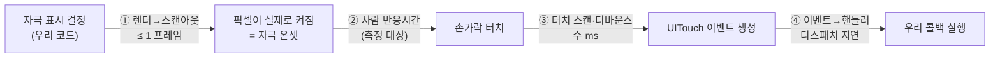

# PVT 타이밍·보정 설계 (Timing Engine)

> 제품의 **심장**. iOS에서 반응시간을 **밀리초 정확도로 재고, 그 정확도를 테스트로 증명**하는 설계.
> 이 문서는 헌법 **제1조(측정 정확도는 타협 불가 — 최상위)**의 실천 설계다. 제1조는 다른
> 모든 조항과 충돌하면 이긴다. 화려함이 정확도를 위협하면 화려함을 버린다.
> 코드 이전의 설계 문서 — 빌드는 macOS+Xcode가 필요하나, **오차원 분석·보정·테스트 전략은
> 여기서 확정**한다.

- **최종 수정:** 2026-07-20
- **상태:** 설계 문서 (구현은 1주차, `CONCEPT.md` §7)
- **관련 스키마:** `PVTSession.displayRefreshHz` · `PVTSession.calibrationOffsetMs` · `PVTTrial`(`stimulusAt`/`respondedAt`/`reactionTimeMs`)

---

## 0. 한 문장

**반응시간 = (사용자 탭의 하드웨어 이벤트 시각) − (자극이 화면에 실제로 나타난 프레임 시각) − (보정 오프셋).**
세 항 모두를 **단조 고정밀 시계**로 재고, 보정값을 데이터로 남겨 **재현 가능**하게 한다.

---

## 1. 타이밍 경로와 오차원 (어디서 ms가 오염되나)

자극 표시 → 사용자 탭 → 기록. 각 단계가 오차를 넣는다. "대충 맞다"는 제1조 2항이 금지한다.



| # | 오차원 | 크기(대략) | 대응 |
|---|--------|-----------|------|
| ① | 렌더 호출 시각 ≠ 픽셀이 켜진 시각 (스캔아웃) | ≤ 1 프레임 (60Hz 16.7ms / 120Hz 8.3ms) | **자극 온셋 = `CADisplayLink`의 프레임 타임스탬프**로 잡는다(§3) |
| ③ | 터치 하드웨어 스캔·디바운스 | 수 ms, 디스플레이 주사율 의존 | 보정 오프셋에 포함(§5). `UITouch.timestamp`는 이벤트 시각이라 ④는 회피 |
| ④ | 이벤트 큐→핸들러 디스패치·메인런루프 지연 | 가변, 오염원 | **응답 시각 = `UITouch.timestamp`(하드웨어 이벤트 시각)**로 잡아 ④를 배제(§4) |
| — | 애니메이션/레이아웃/async가 루프에 끼면 | 수십 ms 오염 | **타이밍 루프에서 전면 배제**(§6, 제1조 1항) |

**핵심 통찰 두 가지**
- 자극 온셋은 "그리라고 명령한 순간"이 아니라 **프레임이 스캔아웃되는 순간**이다 → `CADisplayLink`.
- 응답 시각은 "내 콜백이 도는 순간"이 아니라 **터치 이벤트에 찍힌 하드웨어 타임스탬프**다 → `UITouch.timestamp`.
  이 둘을 지키면 ①·④ 오염을 원천 차단하고, 남는 건 측정·보정 가능한 ③뿐이다.

---

## 2. 시계 — 단조 vs 벽시계

| 용도 | 쓰는 것 | 이유 |
|------|---------|------|
| **측정**(RT 계산) | `DispatchTime.now()` / `mach_absolute_time` (단조 고정밀) | NTP·사용자 시간변경·서머타임에 흔들리지 않음. 나노초 해상도 |
| **표시·저장**(`stimulusAt`, `respondedAt`의 벽시계값) | `Date` | "언제 측정했나"의 사람용 기록. **측정용 아님** |

> 규칙: **`Date`(벽시계)로 반응시간을 빼지 않는다.** 벽시계는 조정되면 음수·점프가 난다.
> `UITouch.timestamp`와 `CADisplayLink.timestamp`는 **같은 단조 기준**(`mach_absolute_time` 기반 `CoreAnimation`/이벤트 시계)이라 **직접 뺄 수 있다** — 이게 이 설계가 성립하는 이유다.

---

## 3. 자극 온셋 — `CADisplayLink`

`CADisplayLink`는 디스플레이 리프레시에 콜백을 동기화하고, 각 콜백에 **그 프레임의 타임스탬프**를 준다.

- `displayLink.timestamp` = 직전 프레임 시각, `targetTimestamp` = 이 콜백이 그리는 프레임이 **표시될 예정 시각**.
- **자극을 표시로 전환한 프레임의 타임스탬프를 자극 온셋(`stimulusAt` 단조값)으로 기록**한다. "그려라"를 호출한 임의 시각이 아니다.
- **주사율을 읽어 `displayRefreshHz`에 저장**(60/120 ProMotion). 온셋 불확실성 = 반프레임(§7)이며 주사율에 따라 달라지므로 측정 조건으로 남긴다(제1조 2항).
- **자극 표시는 상태 플래그 토글**만. 페이드/스케일 애니메이션 금지 — 온셋 시각을 흐린다(제1조 1항, §6).

**자극 간격(ISI, 2~10초)도 `CADisplayLink`로.** `Timer`는 드리프트·합쳐짐(coalescing)이 있어 쓰지 않는다.
목표 온셋 시각을 정해두고 매 프레임 `현재 프레임 타임스탬프 ≥ 목표`인 첫 프레임에 자극을 켠다.

---

## 4. 응답 시각 — `UITouch.timestamp`

- 탭을 `touchesBegan(_:with:)`(또는 이벤트 시각을 보존하는 경로)에서 받고, **`touch.timestamp`**(그 터치의 하드웨어 이벤트 시각, 단조 기준)를 응답 시각으로 쓴다.
- 제스처 인식기/SwiftUI 고수준 제스처는 **인식 지연·디바운스**가 있어 타이밍 경로엔 저수준 터치를 쓴다(제1조 1항). UI 편의 계층과 측정 계층을 분리.
- 첫 접촉(터치 다운)을 응답으로 본다. 릴리즈가 아니라 **다운** 순간이 반응의 정의.

```
reactionTimeMs = (touch.timestamp − stimulusFrameTimestamp) × 1000 − calibrationOffsetMs
```

---

## 5. 보정 오프셋 — `calibrationOffsetMs` (제1조 2항)

측정하고 **보정한다.** 남는 계통 지연은 상수로 빼고, 그 값을 세션에 남겨 재현 가능하게 한다.

**구성**
- **디스플레이 지연:** 프레임 타임스탬프 이후 픽셀이 실제로 밝아지기까지(패널 응답). 기기·주사율 의존.
- **터치 스캔 지연:** 손가락 접촉 → `UITouch` 이벤트 생성까지(①의 ③). 주사율 의존.

**어떻게 값을 얻나 (우선순위)**
1. **외부 물리 검증(그라운드 트루스):** 고속카메라 또는 포토다이오드+마이크로컨트롤러로 "화면 점등 → 자동 탭 → 로그"의 실제 지연을 측정해 상수 도출. (하드웨어·Mac 필요 → §8 테스트 전략에서 검증 항목으로. **미검증이면 미검증이라 적는다**.)
2. **기기별 프로파일 테이블:** 대표 기기의 측정값을 표로. 없으면 보수적 기본 상수 + `isEstimated` 취지의 주석.
3. **온셋 불확실성(반프레임)은 오프셋이 아니라 잔여 오차**로 §7에 정직히 남긴다(상수로 못 없앰).

> 보정 상수를 아직 실측 못 했으면 **0 또는 임시 추정치로 두고 "미보정/추정"임을 세션과 문서에 명시**한다. 제2조 3항 — 한계를 숨기지 않는다.

---

## 6. 타이밍 루프에 **넣지 않는 것** (제1조 1항)

측정 경로(자극 온셋 결정 ~ 응답 시각 획득)에서 배제:

- ❌ 자극의 **암시적/명시적 애니메이션**(페이드·스케일·전환) — 온셋을 흐린다.
- ❌ 자극 표시 프레임의 **레이아웃 패스·뷰 계층 재구성** — 지연·프레임 드랍.
- ❌ 타이밍에 물린 **async/await·네트워크·디스크 I/O·SwiftData 쓰기**. 기록은 응답 시각을 잡은 **뒤** 비동기로.
- ❌ `Timer` 기반 ISI(드리프트) — §3의 `CADisplayLink` 방식으로.
- ❌ `Date` 기반 RT 계산(§2).

원칙: **측정 계층(冴え 엔진)과 표현 계층(애니메이션·さえちゃん)을 물리적으로 분리.** 화려함은 측정이 끝난 뒤에.

---

## 7. 잔여 불확실성 — 정직하게 (제2조)

보정 후에도 없앨 수 없는 오차:

- **자극 온셋 ± 반프레임:** 60Hz면 ±8.3ms, 120Hz면 ±4.2ms. 상수 보정 불가 → 주사율(`displayRefreshHz`)과 함께 남겨 해석 시 고려.
- **터치 스캔 양자화:** 스캔 주기만큼의 이산 오차.
- **단일 세션 사람 변동**은 알고리즘 문서(`score-algorithm.md` §7) 소관.

→ 앱은 "±수 ms 수준의 계측"이라고 **정직하게** 말하고, 없는 정밀도를 주장하지 않는다. `displayRefreshHz`·`calibrationOffsetMs`를 저장하는 것 자체가 "측정 조건을 공개한다"는 제1·2조의 증거다.

---

## 8. 정확도를 어떻게 증명하나 (제1조 3항 — "나중에 테스트"는 없다)

정확도는 **테스트로 증명**한다. 이 프로젝트에 "정확도는 나중" 은 없다. 계층별 전략:

### 8-1. 타이밍 수학 단위 테스트 (플랫폼 독립 — 지금도 종이/추후 Swift Testing)
- RT 계산을 **순수 함수**로 뽑는다: `rt(stimulusTs, touchTs, offset) -> ms`. 부작용·UI 없음.
- **합성 타임스탬프 주입**으로 검증: 알려진 입력 → 기대 출력. 경계값(오프셋, 음수 방지, 타임아웃=무응답 null), 반올림.
- lapse(>500ms)·false start(자극 전 탭 → 음수 간격) 분류 로직도 순수 함수로 테스트.
- ISI 스케줄러: 시드 고정 난수로 **결정적**으로 만들어 재현 가능하게(테스트 용이성).

### 8-2. 시계 계약 테스트
- `UITouch.timestamp`와 `CADisplayLink.timestamp`가 **동일 단조 기준**이라는 가정을 검증(둘의 차가 단조·양수 범위인지). 가정이 깨지면 설계 전제가 무너지므로 명시적으로 확인.

### 8-3. 외부 물리 검증 (그라운드 트루스 — 하드웨어/Mac 필요)
- 포토다이오드(화면 점등 감지) + 솔레노이드/자동 탭 + 마이크로컨트롤러 로거로 **실제 종단 지연** 측정 → §5 보정 상수 도출·검증.
- **이 환경(Windows)에선 불가.** 실측 전까지 보정 상수는 **"미검증"으로 표기**하고, Mac+기기 확보 시 수행(정직성).

### 8-4. 회귀 골든값
- 검증된 케이스의 입력→출력을 골든으로 고정. 엔진 수정이 정확도를 깨면 테스트가 잡는다.

> **정직 원칙:** 8-1·8-2·8-4는 로직 정확도를 증명한다. 8-3(물리 지연 상수)이 없으면 **절대 오프셋은 미보정**이며, 이를 숨기지 않고 세션·README·이 문서에 명시한다.

---

## 9. 데이터로 남기는 것 (재현 가능성)

| 필드 | 무엇 | 조항 |
|------|------|------|
| `PVTTrial.stimulusAt` / `respondedAt` | 자극 온셋·응답의 시각 | 제1·2조 (원자료) |
| `PVTTrial.reactionTimeMs` | 계산된 RT (무응답 null) | 제2조 (사후 검증) |
| `PVTSession.displayRefreshHz` | 측정 시 주사율 | 제1조 2항 (측정 조건) |
| `PVTSession.calibrationOffsetMs` | 적용한 보정 상수 (미보정이면 그 사실) | 제1조 2항 |

원자료(trial 단위)를 보존하므로 오프셋이 나중에 바뀌어도 **재계산**할 수 있다(`data-model.md`).

---

## Deferred (지금 만들지 않는다 — 제7조)

- **기기별 보정 자동 프로파일링** — 기기·OS별 오프셋 자동 추정. MVP는 보수적 상수 + 미검증 표기.
- **적응형 ISI / 세션 길이** — 표준 고정 파라미터부터.

---

## 열린 결정

- **응답 이벤트 획득 경로** — `UIKit` 저수준 터치(`UITouch.timestamp`)를 SwiftUI에 어떻게 연결할지(`UIViewRepresentable` 등). 고수준 제스처의 지연을 피하는 게 조건.
- **타임아웃 문턱**(무응답 → lapse 판정) 값 — PVT 관례 재확인 후 확정.
- **보정 상수 확보 시점·방법** — Mac+기기+포토다이오드 확보 후 8-3 수행.
- **최소 유효 trial 수**(타당도 게이트, `score-algorithm.md` §1-3와 공유).

---

## 참고

- `CONSTITUTION.md` 제1조(정확도)·제2조(정직성)·제7조(단순함).
- `tech-stack.md` §1(정밀 타이밍 스택), `data-model.md`(`PVTSession`/`PVTTrial`), `score-algorithm.md`(이 원자료를 점수로).
- PVT 배경: `CONCEPT.md` §1.
